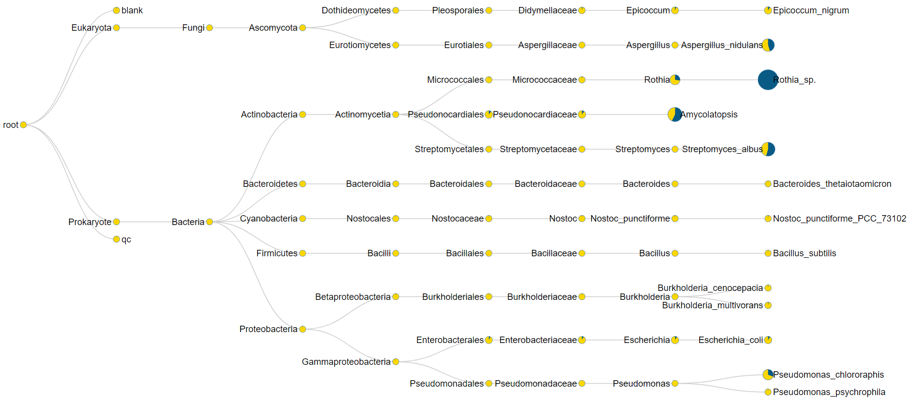
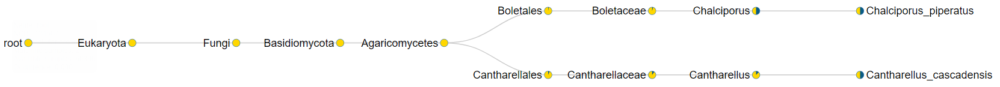
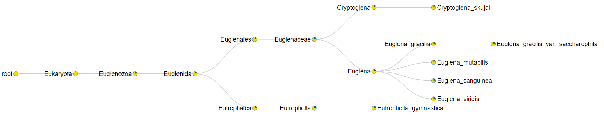

```{r}
rm(list=ls(all=TRUE))
library(tidyverse)
library(magrittr)
library(jsonlite)
library(broom)
```

Read example json file:
```{r}
results_dir <- "microbeMASST_results/"
json_example <- read_json(str_c(results_dir, "fastMASST_HILIC_neg__165_microbe.json"), simplifyVector = F)
```

Define function for iterating over nodes in the MASST output:
```{r}
iterate_masst <- function(masst_node){
  node_attributes <- names(masst_node)
  if ("Rank" %in% node_attributes && masst_node$Rank == "phylum") {
    tibble(
      NAME = masst_node$name, 
      TYPE = masst_node$type, 
      NCBI = masst_node$NCBI, 
      RANK = masst_node$Rank, 
      GROUP_SIZE = masst_node$group_size, 
      MATCHED_SIZE = masst_node$matched_size
      )
  }
  else {
    if ("type" %in% node_attributes && masst_node$type == "node") {
      lapply(masst_node$children, iterate_masst) %>% 
        bind_rows()
    }
    else {
      tibble(
        NAME = character(), 
        TYPE = character(), 
        NCBI = character(), 
        RANK = character(), 
        GROUP_SIZE = integer(), 
        MATCHED_SIZE = integer()
        )
    }
  }
}

iterate_masst(json_example)
```

Set up tibble initialized with all json file names:
```{r}
masst_results <- tibble(FILE_NAME = dir(results_dir, ".*\\.json"))

masst_results
```

Parse info from file names:
```{r}
masst_results <- masst_results %>% 
  mutate(
    SEARCH_TYPE = FILE_NAME %>% str_extract("food|microbe"),
    DATASET = FILE_NAME %>% str_extract("(HILIC|RP).+(pos|neg)"),
    DATASET = if_else(DATASET == "RP_neg", "RP18_neg", DATASET),
    SCAN = FILE_NAME %>% str_extract("__.+_") %>% str_extract("[0-9]+"),
    FEATURE_ID = str_c(
      case_when(
        DATASET == "RP18_pos"  ~ "X94",
        DATASET == "RP18_neg"  ~ "X95",
        DATASET == "HILIC_pos" ~ "X96",
        DATASET == "HILIC_neg" ~ "X97"
      ),
      SCAN %>% str_pad(max(nchar(SCAN)), "left", "0")
    )
  )

masst_results
```

Number of results files per dataset:
```{r}
masst_results %>% 
  count(DATASET)
```

Read json files for microbeMASST:
```{r}
masst_results <- masst_results %>% 
  mutate(
    PATH = str_c(results_dir, FILE_NAME),
    JSON = PATH %>% map(read_json),
    STATS_PHYLUM = JSON %>% map(iterate_masst)
  )

masst_results$JSON[[1]][setdiff(names(masst_results$JSON[[1]]), c("children", "pie_data"))]
```

Add stats for phylum:
```{r}
masst_results <- masst_results %>% 
  mutate(
    STATS_ROOT   = JSON %>% map(~ tibble(ROOT_GROUP_SIZE = .$group_size, ROOT_MATCHED_SIZE = .$matched_size)),
    STATS_PHYLUM = JSON %>% map(iterate_masst)
  )

masst_results$STATS_ROOT[[1]]
masst_results$STATS_PHYLUM[[1]]
```

Select relevant columns and unnest stats:
```{r}
masst_results <- masst_results %>% 
  select(FEATURE_ID, DATASET, SEARCH_TYPE, STATS_ROOT, STATS_PHYLUM) %>% 
  unnest(c(STATS_ROOT, STATS_PHYLUM))

masst_results
```

Check: Is there any other `TYPE` than "node"?
```{r}
masst_results$TYPE %>% unique()
```

Check: Is there any other `RANK` than "phylum"?
```{r}
masst_results$RANK %>% unique()
```

Perform Fisher's exact test for the association between features and phyla:
```{r}
masst_results <- masst_results %>% 
  filter(MATCHED_SIZE > 0) %>% 
  mutate(
    FISHER = pmap(
      list(
        ROOT_GROUP_SIZE, 
        ROOT_MATCHED_SIZE, 
        GROUP_SIZE, 
        MATCHED_SIZE
      ),
      ~ fisher.test(
        matrix(
          c(..1, ..2, ..3, ..4),
          nrow = 2
        )
      )
    ),
    FISHER = FISHER %>% map(tidy)
  ) %>% 
  unnest(FISHER)

masst_results
```

Perform correction for multiple testing and check distribution of p-values:
```{r}
masst_results <- masst_results %>% 
  mutate(p.value.fdr = p.value %>% p.adjust(method = "fdr"))

masst_results %>% 
  ggplot() + 
  geom_point(aes(p.value, p.value.fdr)) +
  geom_abline(slope = 1)

masst_results %>% 
  ggplot() +
  geom_histogram(aes(p.value.fdr, fill = DATASET), bins = 100) +
  scale_x_continuous(breaks = 0:5/5)

masst_results %>% 
  filter(p.value.fdr < 0.1) %>% 
  ggplot() +
  geom_histogram(aes(p.value.fdr, fill = DATASET), bins = 100) +
  scale_x_continuous(breaks = 0:5/50)

masst_results %>% 
    filter(p.value.fdr < 0.01) %>% 
  ggplot() +
  geom_histogram(aes(p.value.fdr, fill = DATASET), bins = 100) +
  scale_x_continuous(breaks = 0:5/500)

masst_results %>% 
  filter(p.value.fdr < 0.001) %>% 
  ggplot() +
  geom_histogram(aes(p.value.fdr, fill = DATASET), bins = 100) +
  scale_x_continuous(breaks = 0:5/5000)
```

Filter for a p-value < 0.01:
```{r}
masst_results <- masst_results %>% 
  filter(p.value.fdr < 0.01)

masst_results
```

Number of significant hits per dataset:
```{r}
masst_results %>% 
  count(DATASET)
```

Number of significant hits per dataset:
```{r}
masst_results %>% 
  group_by(DATASET) %>% 
  summarize(N_FEATURES = n_distinct(FEATURE_ID))
```

Export significant hits for Cytoscape:
```{r}
masst_results %>% 
  mutate(`shared name` = FEATURE_ID %>% str_sub(-5, -1) %>% as.integer()) %>% 
  group_by(DATASET, `shared name`) %>% 
  summarize(MASST_PHYLA = NAME %>% sort() %>% str_c(collapse = ", "), .groups = "drop_last") %>% 
  nest() %>% 
  mutate(
    FILE_NAME = DATASET %>% str_remove("_") %>% str_c(".tsv"),
    DUMMY = map2(data, FILE_NAME, ~ write_tsv(.x, .y))
  )
```

# Map MASST results from features to families

Read feature annotations from file:
```{r}
feature_info <- rbind(
  read_tsv("feature_metadata/C18neg_feature_metadata_consolidated_is_microbial.tsv", guess_max = 100000) %>% 
    mutate(MET_CHEM_NO = paste0("X95", formatC(`#featureID`,        width = 5, flag = "0", format = "d"))) %>% 
    mutate(FAMILY_ID   = paste0("X95", formatC(GNPS_componentindex, width = 4, flag = "0", format = "d"))),
  read_tsv("feature_metadata/C18pos_feature_metadata_consolidated_is_microbial.tsv", guess_max = 100000) %>% 
    mutate(MET_CHEM_NO = paste0("X94", formatC(`#featureID`,        width = 5, flag = "0", format = "d"))) %>% 
    mutate(FAMILY_ID   = paste0("X94", formatC(GNPS_componentindex, width = 4, flag = "0", format = "d"))),
  read_tsv("feature_metadata/HILICneg_feature_metadata_consolidated_is_microbial.tsv", guess_max = 100000) %>% 
    mutate(MET_CHEM_NO = paste0("X97", formatC(`#featureID`,        width = 5, flag = "0", format = "d"))) %>% 
    mutate(FAMILY_ID   = paste0("X97", formatC(GNPS_componentindex, width = 4, flag = "0", format = "d"))),
  read_tsv("feature_metadata/HILICpos_feature_metadata_consolidated_is_microbial.tsv", guess_max = 100000) %>% 
    mutate(MET_CHEM_NO = paste0("X96", formatC(`#featureID`,        width = 5, flag = "0", format = "d"))) %>% 
    mutate(FAMILY_ID   = paste0("X96", formatC(GNPS_componentindex, width = 4, flag = "0", format = "d")))
  ) %>% 
  mutate(FAMILY_ID = if_else(str_detect(FAMILY_ID, "-001$"), "Singleton", FAMILY_ID))
```

Add FAMILY_ID to the MASST results:
```{r}
masst_results <- masst_results %>% 
  inner_join(
    feature_info %>% 
      select(FEATURE_ID = MET_CHEM_NO, FAMILY_ID)
  )

masst_results
```

Number of significant hits per dataset:
```{r}
masst_results %>% 
  group_by(DATASET) %>% 
  summarize(N_FAMILIES = n_distinct(FAMILY_ID), n = n())
```

# Statistical analysis of features

Read statistical results from file:
```{r}
skin_p_cat_dir <- read_tsv("Untargeted.p_cat_dir.tsv")
skin_p_value   <- read_tsv("Untargeted.p_value.tsv")
```

```{r}
skin_p_cat_dir %>% colnames()
```


```{r}
skin_stats <- skin_p_value %>% 
  select(MET_CHEM_NO) %>% 
  left_join(skin_p_cat_dir, by = "MET_CHEM_NO") %>% 
  mutate(
    sebumeter_0.1_any  = `p_cat_dir|base|sebum` %>% is.na(.) %>% not(),
    sebumeter_0.1_up   = `p_cat_dir|base|sebum` %>% is.na(.) %>% not() & `p_cat_dir|base|sebum` %>% str_detect("Up"),
    sebumeter_0.1_down = `p_cat_dir|base|sebum` %>% is.na(.) %>% not() & `p_cat_dir|base|sebum` %>% str_detect("Dn")
  )

skin_stats %>% 
  group_by(`p_cat_dir|base|sebum`, sebumeter_0.1_any) %>% summarize(.groups = "drop")

skin_stats %>% 
  group_by(`p_cat_dir|base|sebum`, sebumeter_0.1_up) %>% summarize(.groups = "drop")

skin_stats %>% 
  group_by(`p_cat_dir|base|sebum`, sebumeter_0.1_down) %>% summarize(.groups = "drop")
```

Check whether there are skin stats for all features from the MASST results:
```{r}
masst_results_stats <- masst_results %>% 
  inner_join(
    skin_stats %>% 
      select(FEATURE_ID = MET_CHEM_NO, sebumeter_0.1_any, sebumeter_0.1_up, sebumeter_0.1_down),
    by = "FEATURE_ID"
  )

setdiff(masst_results$FEATURE_ID, skin_stats$MET_CHEM_NO)
```

* Yes

## Features correlated with sebumeter score

Which features that are positively correlated with sebumeter score are associated with microbes? The figures in each table call are the fdr-corrected p-values for the associations between features and phyla:
```{r}
masst_results_stats %>% 
  filter(sebumeter_0.1_up) %>% 
  pivot_wider(c(FEATURE_ID, DATASET), names_from = NAME, values_from = p.value.fdr)
```

Which features that are negatively correlated with sebumeter score are associated with microbes? The figures in each table call are the fdr-corrected p-values for the associations between features and phyla:
```{r}
masst_results_stats %>% 
  filter(sebumeter_0.1_down) %>% 
  pivot_wider(c(FEATURE_ID, DATASET), names_from = NAME, values_from = p.value.fdr)
```

## Enrichment analysis of features

* Are the features associated with a particular phylum enriched in positive or negative correlations with sebumeter score?
  + Null hypothesis: All features associated with a particular phylum are uncorrelated with sebumeter score.
  + Can be tested by taking the alpha error rate that was used when testing for correlation and assuming a binomial distribution across all features associated with that phylum.
  + Needs the total number of features, but not the total number of phyla.

Calculation of binomial distribution:

* N_FEATURES: Number of features significantly associated with the respective phylum, regardless of their correlation with sebumeter score
* N_ANY: Number of features significantly associated with the respective phylum *and* significantly correlated with sebumeter score, regardless of direction
* N_POS: Number of features significantly associated with the respective phylum *and* positively correlated with sebumeter score
* N_NEG: Number of features significantly associated with the respective phylum *and* negatively correlated with sebumeter score

The binomial distribution gives the probability that the observed or a higher number of features is correlated with sebumeter score just by chance (false positives).
```{r}
p_alpha <- 0.1

masst_results_stats %>% 
  group_by(NAME) %>% 
  summarize(
    N_FEATURES = n(),
    N_ANY      = sum(sebumeter_0.1_any),
    N_POS      = sum(sebumeter_0.1_up),
    N_NEG      = sum(sebumeter_0.1_down)
  ) %>% 
  rowwise() %>% 
  mutate(
    PBINOM_ANY = pbinom(N_ANY, N_FEATURES, p_alpha, lower.tail = F) %>% format(digits = 2),
    PBINOM_POS = pbinom(N_POS, N_FEATURES, p_alpha, lower.tail = F) %>% format(digits = 2),
    PBINOM_NEG = pbinom(N_NEG, N_FEATURES, p_alpha, lower.tail = F) %>% format(digits = 2)
  )
```

* A significant enrichment is found only for phyla with few associated features:
  + Bacillariophyta show a significant enrichment of associated features which are *negatively* correlated with sebumeter score
  + Euglenozoa show a significant enrichment of associated features which are *negatively* correlated with sebumeter score

Are these enrichments false positives, or are significant correlations with sebumeter score diluted by statistical noise in the phyla with many associated features?
  
# Statistical analysis of families

Read statistical results from file:
```{r}
skin_p_cat_dir <- read_tsv("Aggregated_p_cat_dir.tsv")
skin_p_value   <- read_tsv("Aggregated_p_value.tsv")
```

```{r}
skin_p_cat_dir %>% colnames()
```


```{r}
skin_stats <- skin_p_value %>% 
  select(FAMILY_ID) %>% 
  left_join(skin_p_cat_dir, by = "FAMILY_ID") %>% 
  mutate(
    sebumeter_0.1_any  = `p_cat_dir|base|sebum` %>% is.na(.) %>% not(),
    sebumeter_0.1_up   = `p_cat_dir|base|sebum` %>% is.na(.) %>% not() & `p_cat_dir|base|sebum` %>% str_detect("Up"),
    sebumeter_0.1_down = `p_cat_dir|base|sebum` %>% is.na(.) %>% not() & `p_cat_dir|base|sebum` %>% str_detect("Dn")
  )

skin_stats %>% 
  group_by(`p_cat_dir|base|sebum`, sebumeter_0.1_any) %>% summarize(.groups = "drop")

skin_stats %>% 
  group_by(`p_cat_dir|base|sebum`, sebumeter_0.1_up) %>% summarize(.groups = "drop")

skin_stats %>% 
  group_by(`p_cat_dir|base|sebum`, sebumeter_0.1_down) %>% summarize(.groups = "drop")
```

Aggregate by phylum and family:
```{r}
masst_results_family <- masst_results %>% 
  group_by(NAME, FAMILY_ID) %>% 
  summarize(N_FEATURES = n(), .groups = "drop")

masst_results_family
```

Check whether there are skin stats for all families from the MASST results:
```{r}
masst_results_stats <- masst_results_family %>% 
  inner_join(
    skin_stats %>% 
      select(FAMILY_ID, sebumeter_0.1_any, sebumeter_0.1_up, sebumeter_0.1_down),
    by = "FAMILY_ID"
  )

setdiff(masst_results$FAMILY_ID, skin_stats$FAMILY_ID)
```

* Some families from the MASST results are missing from the skin stats.

Why are these families missing?
```{r}
feature_info %>% 
  filter(FAMILY_ID %in% c("X970885", "X961864", "X950468", "X940057")) %>% 
  count(FAMILY_ID)
```

* These families only two nodes, but aggregation was performed only for families with three or more nodes.

## Families correlated with sebumeter score

Which families that are positively correlated with sebumeter score are associated with microbes? The figures in each table call are the number of features from that family which are associated with the respective phylum:
```{r}
masst_results_stats %>% 
  filter(sebumeter_0.1_up) %>% 
  inner_join(
    feature_info %>% 
      count(FAMILY_ID),
    by = "FAMILY_ID"
  ) %>% 
  pivot_wider(c(FAMILY_ID, n), names_from = NAME, values_from = N_FEATURES, names_sort = T) %>% 
  arrange(FAMILY_ID)
```

* X940029 is a big family comprising 99 features, of which several are associated with different phyla. **This family is interesting.**
* X950190 is a medium-size family comprising 22 features, of which only one is associated with Basidiomycota.

Which families that are positively correlated with sebumeter score are associated with microbes? The figures in each table call are the number of features from that family which are associated with the respective phylum:
```{r}
masst_results_stats %>% 
  filter(sebumeter_0.1_down) %>% 
  inner_join(
    feature_info %>% 
      count(FAMILY_ID),
    by = "FAMILY_ID"
  ) %>% 
  pivot_wider(c(FAMILY_ID, n), names_from = NAME, values_from = N_FEATURES, names_sort = T) %>% 
  arrange(FAMILY_ID)
```

* X940005 is a big family comprising 86 features, of which several are associated with different phyla. **This family is interesting.**
* X950477 is a medium-size family comprising 17 features, of which one is associated with Actinobacteria and one with Basidiomycota (could be the same feature).
* X970034 is a medium-size family comprising 17 features, of which one is associated with Ascomycota and one with Bacillariophyta (could be the same feature).
* X950167 is a medium-size family comprising 16 features, of which 6 are associated with Euglenozoa. **This may be interesting, but the role of euglenozoa on the skin is unclear to me.** However see https://royalsocietypublishing.org/doi/10.1098/rsob.200407

## Enrichment analysis of families

* Are the features associated with a particular phylum enriched in positive or negative correlations with sebumeter score?
  + Null hypothesis: All features associated with a particular phylum are uncorrelated with sebumeter score.
  + Can be tested by taking the alpha error rate that was used when testing for correlation and assuming a binomial distribution across all features associated with that phylum.
  + Needs the total number of features, but not the total number of phyla.

Calculation of binomial distribution:

* N_FEATURES: Number of features significantly associated with the respective phylum, regardless of their correlation with sebumeter score
* N_FAMILIES: Number of families significantly associated with the respective phylum, regardless of their correlation with sebumeter score
* N_ANY: Number of families significantly associated with the respective phylum *and* significantly correlated with sebumeter score, regardless of direction
* N_POS: Number of families significantly associated with the respective phylum *and* positively correlated with sebumeter score
* N_NEG: Number of families significantly associated with the respective phylum *and* negatively correlated with sebumeter score

The binomial distribution gives the probability that the observed or a higher number of families is correlated with sebumeter score just by chance (false positives).
```{r}
p_alpha <- 0.1

masst_results_stats %>% 
  group_by(NAME) %>% 
  summarize(
    N_FEATURES = sum(N_FEATURES),
    N_FAMILIES = n(),
    N_ANY      = sum(sebumeter_0.1_any),
    N_POS      = sum(sebumeter_0.1_up),
    N_NEG      = sum(sebumeter_0.1_down)
  ) %>% 
  rowwise() %>% 
  mutate(
    PBINOM_CHANGED = pbinom(N_ANY, N_FAMILIES, p_alpha, lower.tail = F) %>% format(digits = 2),
    PBINOM_UP      = pbinom(N_POS, N_FAMILIES, p_alpha, lower.tail = F) %>% format(digits = 2),
    PBINOM_DOWN    = pbinom(N_NEG, N_FAMILIES, p_alpha, lower.tail = F) %>% format(digits = 2)
  )
```

* A significant enrichment is found only for phyla with few associated families:
  + Spirochaetes show a significant enrichment of associated features which are *positively* or *negatively* correlated with sebumeter score
  + Zoopagomycota show a significant enrichment of associated features which are *positively* correlated with sebumeter score

These are different phyla than found in the enrichment analysis on features, which is another indication that the enrichment may not be meaningful. Individual associations may of course still be meaningful.

# Interesting molecular families

## Families positively correlated with sebumeter score

### X940029


```{r}
masst_results %>% 
  filter(FAMILY_ID == "X940029") %>% 
  pivot_wider(FEATURE_ID, names_from = NAME, values_from = p.value.fdr, names_sort = T) %>% 
  arrange(FEATURE_ID)
```



```{r}
masst_results %>% 
  filter(FEATURE_ID == "X9400174") %>% 
  group_by(FEATURE_ID) %>% 
  summarize(PHYLA = NAME %>% str_c(collapse = ", ")) %>% 
  as.list()

feature_info %>% 
  filter(MET_CHEM_NO == "X9400174") %>% 
  select(MET_CHEM_NO, starts_with("Cons_"), `CAN_all classifications`) %>% 
  as.list()
```


```{r}
masst_results %>% 
  filter(FEATURE_ID == "X9400257") %>% 
  group_by(FEATURE_ID) %>% 
  summarize(PHYLA = NAME %>% str_c(collapse = ", ")) %>% 
  as.list()

feature_info %>% 
  filter(MET_CHEM_NO == "X9400257") %>% 
  select(MET_CHEM_NO, starts_with("Cons_"), `CAN_all classifications`) %>% 
  as.list()
```


```{r}
masst_results %>% 
  filter(FEATURE_ID == "X9400316") %>% 
  group_by(FEATURE_ID) %>% 
  summarize(PHYLA = NAME %>% str_c(collapse = ", ")) %>% 
  as.list()

feature_info %>% 
  filter(MET_CHEM_NO == "X9400316") %>% 
  select(MET_CHEM_NO, starts_with("Cons_"), `CAN_all classifications`) %>% 
  as.list()
```


```{r}
masst_results %>% 
  filter(FEATURE_ID == "X9400904") %>% 
  group_by(FEATURE_ID) %>% 
  summarize(PHYLA = NAME %>% str_c(collapse = ", ")) %>% 
  as.list()

feature_info %>% 
  filter(MET_CHEM_NO == "X9400904") %>% 
  select(MET_CHEM_NO, starts_with("Cons_"), `CAN_all classifications`) %>% 
  as.list()
```


```{r}
masst_results %>% 
  filter(FEATURE_ID == "X9401121") %>% 
  group_by(FEATURE_ID) %>% 
  summarize(PHYLA = NAME %>% str_c(collapse = ", ")) %>% 
  as.list()

feature_info %>% 
  filter(MET_CHEM_NO == "X9401121") %>% 
  select(MET_CHEM_NO, starts_with("Cons_"), `CAN_all classifications`) %>% 
  as.list()
```


```{r}
masst_results %>% 
  filter(FEATURE_ID == "X9401123") %>% 
  group_by(FEATURE_ID) %>% 
  summarize(PHYLA = NAME %>% str_c(collapse = ", ")) %>% 
  as.list()

feature_info %>% 
  filter(MET_CHEM_NO == "X9401123") %>% 
  select(MET_CHEM_NO, starts_with("Cons_"), `CAN_all classifications`) %>% 
  as.list()
```


```{r}
masst_results %>% 
  filter(FEATURE_ID == "X9402192") %>% 
  group_by(FEATURE_ID) %>% 
  summarize(PHYLA = NAME %>% str_c(collapse = ", ")) %>% 
  as.list()

feature_info %>% 
  filter(MET_CHEM_NO == "X9402192") %>% 
  select(MET_CHEM_NO, starts_with("Cons_"), `CAN_all classifications`) %>% 
  as.list()
```


```{r}
masst_results %>% 
  filter(FEATURE_ID == "X9402417") %>% 
  group_by(FEATURE_ID) %>% 
  summarize(PHYLA = NAME %>% str_c(collapse = ", ")) %>% 
  as.list()

feature_info %>% 
  filter(MET_CHEM_NO == "X9402417") %>% 
  select(MET_CHEM_NO, starts_with("Cons_"), `CAN_all classifications`) %>% 
  as.list()
```


```{r}
masst_results %>% 
  filter(FEATURE_ID == "X9402498") %>% 
  group_by(FEATURE_ID) %>% 
  summarize(PHYLA = NAME %>% str_c(collapse = ", ")) %>% 
  as.list()

feature_info %>% 
  filter(MET_CHEM_NO == "X9402498") %>% 
  select(MET_CHEM_NO, starts_with("Cons_"), `CAN_all classifications`) %>% 
  as.list()
```


```{r}
masst_results %>% 
  filter(FEATURE_ID == "X9402674") %>% 
  group_by(FEATURE_ID) %>% 
  summarize(PHYLA = NAME %>% str_c(collapse = ", ")) %>% 
  as.list()

feature_info %>% 
  filter(MET_CHEM_NO == "X9402674") %>% 
  select(MET_CHEM_NO, starts_with("Cons_"), `CAN_all classifications`) %>% 
  as.list()
```


```{r}
masst_results %>% 
  filter(FEATURE_ID == "X9404362") %>% 
  group_by(FEATURE_ID) %>% 
  summarize(PHYLA = NAME %>% str_c(collapse = ", ")) %>% 
  as.list()

feature_info %>% 
  filter(MET_CHEM_NO == "X9404362") %>% 
  select(MET_CHEM_NO, starts_with("Cons_"), `CAN_all classifications`) %>% 
  as.list()
```


```{r}
masst_results %>% 
  filter(FEATURE_ID == "X9404581") %>% 
  group_by(FEATURE_ID) %>% 
  summarize(PHYLA = NAME %>% str_c(collapse = ", ")) %>% 
  as.list()

feature_info %>% 
  filter(MET_CHEM_NO == "X9404581") %>% 
  select(MET_CHEM_NO, starts_with("Cons_"), `CAN_all classifications`) %>% 
  as.list()
```


```{r}
masst_results %>% 
  filter(FEATURE_ID == "X9407909") %>% 
  group_by(FEATURE_ID) %>% 
  summarize(PHYLA = NAME %>% str_c(collapse = ", ")) %>% 
  as.list()

feature_info %>% 
  filter(MET_CHEM_NO == "X9407909") %>% 
  select(MET_CHEM_NO, starts_with("Cons_"), `CAN_all classifications`) %>% 
  as.list()
```


```{r}
masst_results %>% 
  filter(FEATURE_ID == "X9409048") %>% 
  group_by(FEATURE_ID) %>% 
  summarize(PHYLA = NAME %>% str_c(collapse = ", ")) %>% 
  as.list()

feature_info %>% 
  filter(MET_CHEM_NO == "X9409048") %>% 
  select(MET_CHEM_NO, starts_with("Cons_"), `CAN_all classifications`) %>% 
  as.list()
```


```{r}
masst_results %>% 
  filter(FEATURE_ID == "X9421045") %>% 
  group_by(FEATURE_ID) %>% 
  summarize(PHYLA = NAME %>% str_c(collapse = ", ")) %>% 
  as.list()

feature_info %>% 
  filter(MET_CHEM_NO == "X9421045") %>% 
  select(MET_CHEM_NO, starts_with("Cons_"), `CAN_all classifications`) %>% 
  as.list()
```


```{r}
masst_results %>% 
  filter(FEATURE_ID == "X9421657") %>% 
  group_by(FEATURE_ID) %>% 
  summarize(PHYLA = NAME %>% str_c(collapse = ", ")) %>% 
  as.list()

feature_info %>% 
  filter(MET_CHEM_NO == "X9421657") %>% 
  select(MET_CHEM_NO, starts_with("Cons_"), `CAN_all classifications`) %>% 
  as.list()
```


```{r}
masst_results %>% 
  filter(FEATURE_ID == "X9423263") %>% 
  group_by(FEATURE_ID) %>% 
  summarize(PHYLA = NAME %>% str_c(collapse = ", ")) %>% 
  as.list()

feature_info %>% 
  filter(MET_CHEM_NO == "X9423263") %>% 
  select(MET_CHEM_NO, starts_with("Cons_"), `CAN_all classifications`) %>% 
  as.list()
```


```{r}
masst_results %>% 
  filter(FEATURE_ID == "X9423629") %>% 
  group_by(FEATURE_ID) %>% 
  summarize(PHYLA = NAME %>% str_c(collapse = ", ")) %>% 
  as.list()

feature_info %>% 
  filter(MET_CHEM_NO == "X9423629") %>% 
  select(MET_CHEM_NO, starts_with("Cons_"), `CAN_all classifications`) %>% 
  as.list()
```


```{r}
masst_results %>% 
  filter(FEATURE_ID == "X9426846") %>% 
  group_by(FEATURE_ID) %>% 
  summarize(PHYLA = NAME %>% str_c(collapse = ", ")) %>% 
  as.list()

feature_info %>% 
  filter(MET_CHEM_NO == "X9426846") %>% 
  select(MET_CHEM_NO, starts_with("Cons_"), `CAN_all classifications`) %>% 
  as.list()
```


```{r}
masst_results %>% 
  filter(FEATURE_ID == "X9430538") %>% 
  group_by(FEATURE_ID) %>% 
  summarize(PHYLA = NAME %>% str_c(collapse = ", ")) %>% 
  as.list()

feature_info %>% 
  filter(MET_CHEM_NO == "X9430538") %>% 
  select(MET_CHEM_NO, starts_with("Cons_"), `CAN_all classifications`) %>% 
  as.list()
```


```{r}
masst_results %>% 
  filter(FEATURE_ID == "X9433405") %>% 
  group_by(FEATURE_ID) %>% 
  summarize(PHYLA = NAME %>% str_c(collapse = ", ")) %>% 
  as.list()

feature_info %>% 
  filter(MET_CHEM_NO == "X9433405") %>% 
  select(MET_CHEM_NO, starts_with("Cons_"), `CAN_all classifications`) %>% 
  as.list()
```

### X950190


```{r}
masst_results %>% 
  filter(FAMILY_ID == "X950190") %>% 
  pivot_wider(FEATURE_ID, names_from = NAME, values_from = p.value.fdr, names_sort = T) %>% 
  arrange(FEATURE_ID)
```



```{r}
masst_results %>% 
  filter(FEATURE_ID == "X9502693") %>% 
  group_by(FEATURE_ID) %>% 
  summarize(PHYLA = NAME %>% str_c(collapse = ", ")) %>% 
  as.list()

feature_info %>% 
  filter(MET_CHEM_NO == "X9502693") %>% 
  select(MET_CHEM_NO, starts_with("Cons_"), `CAN_all classifications`) %>% 
  as.list()
```

## Families negatively correlated with sebumeter score

### X940005


```{r}
masst_results %>% 
  filter(FAMILY_ID == "X940005") %>% 
  pivot_wider(FEATURE_ID, names_from = NAME, values_from = p.value.fdr, names_sort = T) %>% 
  arrange(FEATURE_ID)
```


```{r}
masst_results %>% 
  filter(FEATURE_ID == "X9401814") %>% 
  group_by(FEATURE_ID) %>% 
  summarize(PHYLA = NAME %>% str_c(collapse = ", ")) %>% 
  as.list()

feature_info %>% 
  filter(MET_CHEM_NO == "X9401814") %>% 
  select(MET_CHEM_NO, starts_with("Cons_"), `CAN_all classifications`) %>% 
  as.list()
```


```{r}
masst_results %>% 
  filter(FEATURE_ID == "X9402252") %>% 
  group_by(FEATURE_ID) %>% 
  summarize(PHYLA = NAME %>% str_c(collapse = ", ")) %>% 
  as.list()

feature_info %>% 
  filter(MET_CHEM_NO == "X9402252") %>% 
  select(MET_CHEM_NO, starts_with("Cons_"), `CAN_all classifications`) %>% 
  as.list()
```


```{r}
masst_results %>% 
  filter(FEATURE_ID == "X9402352") %>% 
  group_by(FEATURE_ID) %>% 
  summarize(PHYLA = NAME %>% str_c(collapse = ", ")) %>% 
  as.list()

feature_info %>% 
  filter(MET_CHEM_NO == "X9402352") %>% 
  select(MET_CHEM_NO, starts_with("Cons_"), `CAN_all classifications`) %>% 
  as.list()
```


```{r}
masst_results %>% 
  filter(FEATURE_ID == "X9402579") %>% 
  group_by(FEATURE_ID) %>% 
  summarize(PHYLA = NAME %>% str_c(collapse = ", ")) %>% 
  as.list()

feature_info %>% 
  filter(MET_CHEM_NO == "X9402579") %>% 
  select(MET_CHEM_NO, starts_with("Cons_"), `CAN_all classifications`) %>% 
  as.list()
```


```{r}
masst_results %>% 
  filter(FEATURE_ID == "X9402985") %>% 
  group_by(FEATURE_ID) %>% 
  summarize(PHYLA = NAME %>% str_c(collapse = ", ")) %>% 
  as.list()

feature_info %>% 
  filter(MET_CHEM_NO == "X9402985") %>% 
  select(MET_CHEM_NO, starts_with("Cons_"), `CAN_all classifications`) %>% 
  as.list()
```


```{r}
masst_results %>% 
  filter(FEATURE_ID == "X9404602") %>% 
  group_by(FEATURE_ID) %>% 
  summarize(PHYLA = NAME %>% str_c(collapse = ", ")) %>% 
  as.list()

feature_info %>% 
  filter(MET_CHEM_NO == "X9404602") %>% 
  select(MET_CHEM_NO, starts_with("Cons_"), `CAN_all classifications`) %>% 
  as.list()
```


```{r}
masst_results %>% 
  filter(FEATURE_ID == "X9405371") %>% 
  group_by(FEATURE_ID) %>% 
  summarize(PHYLA = NAME %>% str_c(collapse = ", ")) %>% 
  as.list()

feature_info %>% 
  filter(MET_CHEM_NO == "X9405371") %>% 
  select(MET_CHEM_NO, starts_with("Cons_"), `CAN_all classifications`) %>% 
  as.list()
```


```{r}
masst_results %>% 
  filter(FEATURE_ID == "X9411450") %>% 
  group_by(FEATURE_ID) %>% 
  summarize(PHYLA = NAME %>% str_c(collapse = ", ")) %>% 
  as.list()

feature_info %>% 
  filter(MET_CHEM_NO == "X9411450") %>% 
  select(MET_CHEM_NO, starts_with("Cons_"), `CAN_all classifications`) %>% 
  as.list()
```


```{r}
masst_results %>% 
  filter(FEATURE_ID == "X9412241") %>% 
  group_by(FEATURE_ID) %>% 
  summarize(PHYLA = NAME %>% str_c(collapse = ", ")) %>% 
  as.list()

feature_info %>% 
  filter(MET_CHEM_NO == "X9412241") %>% 
  select(MET_CHEM_NO, starts_with("Cons_"), `CAN_all classifications`) %>% 
  as.list()
```


```{r}
masst_results %>% 
  filter(FEATURE_ID == "X9412614") %>% 
  group_by(FEATURE_ID) %>% 
  summarize(PHYLA = NAME %>% str_c(collapse = ", ")) %>% 
  as.list()

feature_info %>% 
  filter(MET_CHEM_NO == "X9412614") %>% 
  select(MET_CHEM_NO, starts_with("Cons_"), `CAN_all classifications`) %>% 
  as.list()
```


```{r}
masst_results %>% 
  filter(FEATURE_ID == "X9413313") %>% 
  group_by(FEATURE_ID) %>% 
  summarize(PHYLA = NAME %>% str_c(collapse = ", ")) %>% 
  as.list()

feature_info %>% 
  filter(MET_CHEM_NO == "X9413313") %>% 
  select(MET_CHEM_NO, starts_with("Cons_"), `CAN_all classifications`) %>% 
  as.list()
```


```{r}
masst_results %>% 
  filter(FEATURE_ID == "X9413456") %>% 
  group_by(FEATURE_ID) %>% 
  summarize(PHYLA = NAME %>% str_c(collapse = ", ")) %>% 
  as.list()

feature_info %>% 
  filter(MET_CHEM_NO == "X9413456") %>% 
  select(MET_CHEM_NO, starts_with("Cons_"), `CAN_all classifications`) %>% 
  as.list()
```


```{r}
masst_results %>% 
  filter(FEATURE_ID == "X9420364") %>% 
  group_by(FEATURE_ID) %>% 
  summarize(PHYLA = NAME %>% str_c(collapse = ", ")) %>% 
  as.list()

feature_info %>% 
  filter(MET_CHEM_NO == "X9420364") %>% 
  select(MET_CHEM_NO, starts_with("Cons_"), `CAN_all classifications`) %>% 
  as.list()
```


```{r}
masst_results %>% 
  filter(FEATURE_ID == "X9423545") %>% 
  group_by(FEATURE_ID) %>% 
  summarize(PHYLA = NAME %>% str_c(collapse = ", ")) %>% 
  as.list()

feature_info %>% 
  filter(MET_CHEM_NO == "X9423545") %>% 
  select(MET_CHEM_NO, starts_with("Cons_"), `CAN_all classifications`) %>% 
  as.list()
```


```{r}
masst_results %>% 
  filter(FEATURE_ID == "X9424117") %>% 
  group_by(FEATURE_ID) %>% 
  summarize(PHYLA = NAME %>% str_c(collapse = ", ")) %>% 
  as.list()

feature_info %>% 
  filter(MET_CHEM_NO == "X9424117") %>% 
  select(MET_CHEM_NO, starts_with("Cons_"), `CAN_all classifications`) %>% 
  as.list()
```


```{r}
masst_results %>% 
  filter(FEATURE_ID == "X9425174") %>% 
  group_by(FEATURE_ID) %>% 
  summarize(PHYLA = NAME %>% str_c(collapse = ", ")) %>% 
  as.list()

feature_info %>% 
  filter(MET_CHEM_NO == "X9425174") %>% 
  select(MET_CHEM_NO, starts_with("Cons_"), `CAN_all classifications`) %>% 
  as.list()
```


```{r}
masst_results %>% 
  filter(FEATURE_ID == "X9427382") %>% 
  group_by(FEATURE_ID) %>% 
  summarize(PHYLA = NAME %>% str_c(collapse = ", ")) %>% 
  as.list()

feature_info %>% 
  filter(MET_CHEM_NO == "X9427382") %>% 
  select(MET_CHEM_NO, starts_with("Cons_"), `CAN_all classifications`) %>% 
  as.list()
```


```{r}
masst_results %>% 
  filter(FEATURE_ID == "X9428222") %>% 
  group_by(FEATURE_ID) %>% 
  summarize(PHYLA = NAME %>% str_c(collapse = ", ")) %>% 
  as.list()

feature_info %>% 
  filter(MET_CHEM_NO == "X9428222") %>% 
  select(MET_CHEM_NO, starts_with("Cons_"), `CAN_all classifications`) %>% 
  as.list()
```


```{r}
masst_results %>% 
  filter(FEATURE_ID == "X9429529") %>% 
  group_by(FEATURE_ID) %>% 
  summarize(PHYLA = NAME %>% str_c(collapse = ", ")) %>% 
  as.list()

feature_info %>% 
  filter(MET_CHEM_NO == "X9429529") %>% 
  select(MET_CHEM_NO, starts_with("Cons_"), `CAN_all classifications`) %>% 
  as.list()
```

### X950167


```{r}
masst_results %>% 
  filter(FAMILY_ID == "X950167") %>% 
  pivot_wider(FEATURE_ID, names_from = NAME, values_from = p.value.fdr, names_sort = T) %>% 
  arrange(FEATURE_ID)
```


```{r}
masst_results %>% 
  filter(FEATURE_ID == "X9500389") %>% 
  group_by(FEATURE_ID) %>% 
  summarize(PHYLA = NAME %>% str_c(collapse = ", ")) %>% 
  as.list()

feature_info %>% 
  filter(MET_CHEM_NO == "X9500389") %>% 
  select(MET_CHEM_NO, starts_with("Cons_"), `CAN_all classifications`) %>% 
  as.list()
```


```{r}
masst_results %>% 
  filter(FEATURE_ID == "X9500391") %>% 
  group_by(FEATURE_ID) %>% 
  summarize(PHYLA = NAME %>% str_c(collapse = ", ")) %>% 
  as.list()

feature_info %>% 
  filter(MET_CHEM_NO == "X9500391") %>% 
  select(MET_CHEM_NO, starts_with("Cons_"), `CAN_all classifications`) %>% 
  as.list()
```


```{r}
masst_results %>% 
  filter(FEATURE_ID == "X9500396") %>% 
  group_by(FEATURE_ID) %>% 
  summarize(PHYLA = NAME %>% str_c(collapse = ", ")) %>% 
  as.list()

feature_info %>% 
  filter(MET_CHEM_NO == "X9500396") %>% 
  select(MET_CHEM_NO, starts_with("Cons_"), `CAN_all classifications`) %>% 
  as.list()
```


```{r}
masst_results %>% 
  filter(FEATURE_ID == "X9502327") %>% 
  group_by(FEATURE_ID) %>% 
  summarize(PHYLA = NAME %>% str_c(collapse = ", ")) %>% 
  as.list()

feature_info %>% 
  filter(MET_CHEM_NO == "X9502327") %>% 
  select(MET_CHEM_NO, starts_with("Cons_"), `CAN_all classifications`) %>% 
  as.list()
```



```{r}
masst_results %>% 
  filter(FEATURE_ID == "X9502350") %>% 
  group_by(FEATURE_ID) %>% 
  summarize(PHYLA = NAME %>% str_c(collapse = ", ")) %>% 
  as.list()

feature_info %>% 
  filter(MET_CHEM_NO == "X9502350") %>% 
  select(MET_CHEM_NO, starts_with("Cons_"), `CAN_all classifications`) %>% 
  as.list()
```


```{r}
masst_results %>% 
  filter(FEATURE_ID == "X9506236") %>% 
  group_by(FEATURE_ID) %>% 
  summarize(PHYLA = NAME %>% str_c(collapse = ", ")) %>% 
  as.list()

feature_info %>% 
  filter(MET_CHEM_NO == "X9506236") %>% 
  select(MET_CHEM_NO, starts_with("Cons_"), `CAN_all classifications`) %>% 
  as.list()
```

### X950477


```{r}
masst_results %>% 
  filter(FAMILY_ID == "X950477") %>% 
  pivot_wider(FEATURE_ID, names_from = NAME, values_from = p.value.fdr, names_sort = T) %>% 
  arrange(FEATURE_ID)
```


```{r}
masst_results %>% 
  filter(FEATURE_ID == "X9503038") %>% 
  group_by(FEATURE_ID) %>% 
  summarize(PHYLA = NAME %>% str_c(collapse = ", ")) %>% 
  as.list()

feature_info %>% 
  filter(MET_CHEM_NO == "X9503038") %>% 
  select(MET_CHEM_NO, starts_with("Cons_"), `CAN_all classifications`) %>% 
  as.list()
```


```{r}
masst_results %>% 
  filter(FEATURE_ID == "X9503142") %>% 
  group_by(FEATURE_ID) %>% 
  summarize(PHYLA = NAME %>% str_c(collapse = ", ")) %>% 
  as.list()

feature_info %>% 
  filter(MET_CHEM_NO == "X9503142") %>% 
  select(MET_CHEM_NO, starts_with("Cons_"), `CAN_all classifications`) %>% 
  as.list()
```

### X970034


```{r}
masst_results %>% 
  filter(FAMILY_ID == "X970034") %>% 
  pivot_wider(FEATURE_ID, names_from = NAME, values_from = p.value.fdr, names_sort = T) %>% 
  arrange(FEATURE_ID)
```


```{r}
masst_results %>% 
  filter(FEATURE_ID == "X9701864") %>% 
  group_by(FEATURE_ID) %>% 
  summarize(PHYLA = NAME %>% str_c(collapse = ", ")) %>% 
  as.list()

feature_info %>% 
  filter(MET_CHEM_NO == "X9701864") %>% 
  select(MET_CHEM_NO, starts_with("Cons_"), `CAN_all classifications`) %>% 
  as.list()
```


```{r}
masst_results %>% 
  filter(FEATURE_ID == "X9707384") %>% 
  group_by(FEATURE_ID) %>% 
  summarize(PHYLA = NAME %>% str_c(collapse = ", ")) %>% 
  as.list()

feature_info %>% 
  filter(MET_CHEM_NO == "X9707384") %>% 
  select(MET_CHEM_NO, starts_with("Cons_"), `CAN_all classifications`) %>% 
  as.list()
```

# Session info

```{r}
sessionInfo()
```
