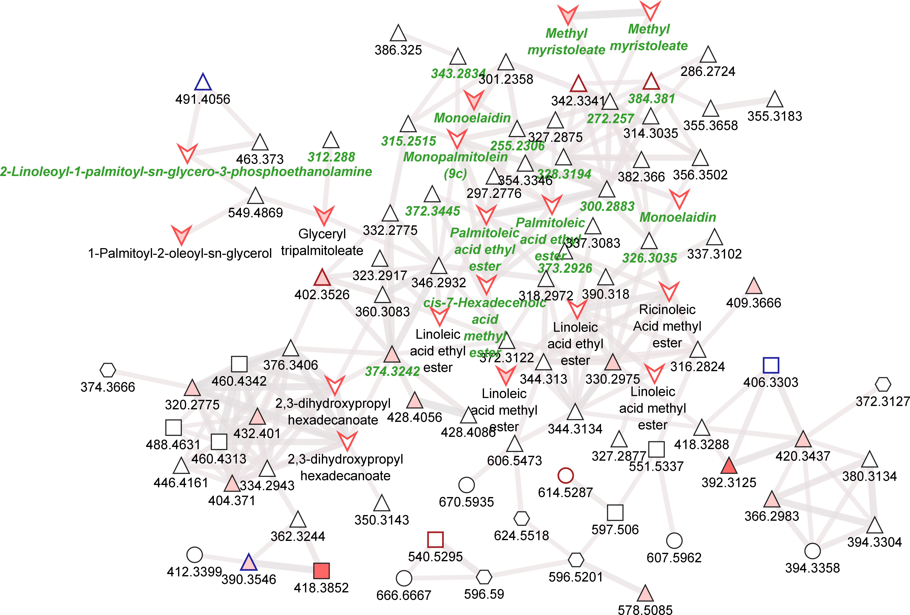
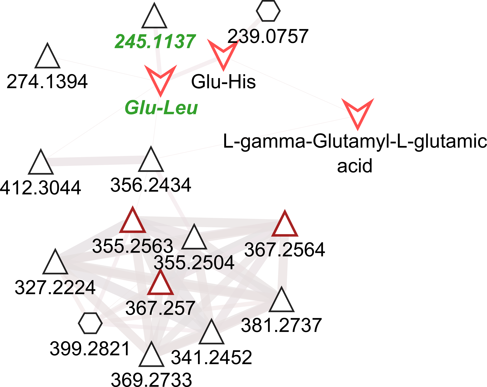
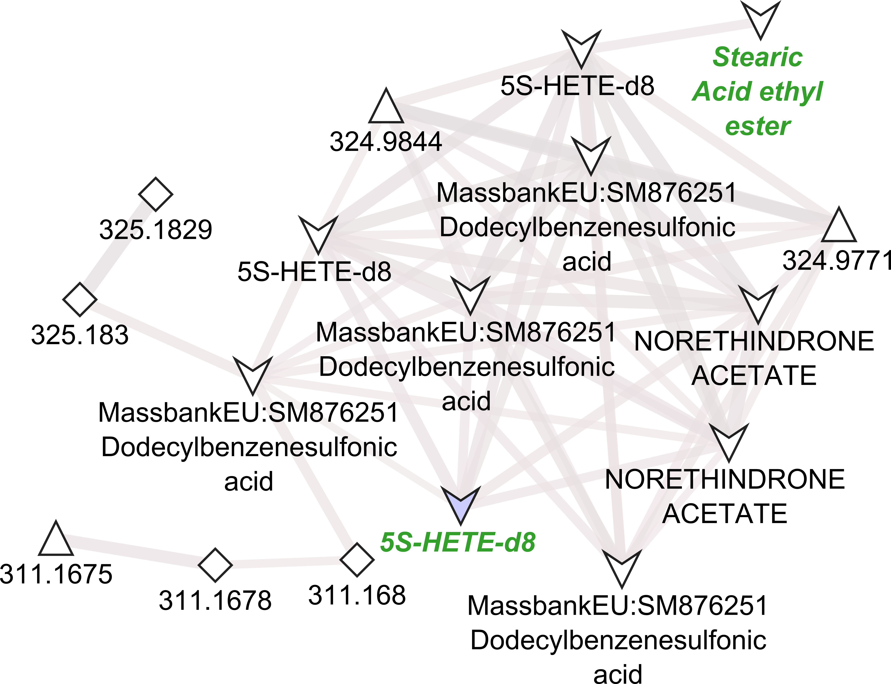

```{r}
rm(list=ls(all=TRUE))
library(tidyverse)
library(magrittr)
library(jsonlite)
library(broom)
```

Read example json file:
```{r}
results_dir <- "microbeMASST_results/"
json_example <- read_json(str_c(results_dir, "fastMASST_HILIC_neg__165_microbe.json"), simplifyVector = F)
```

Define function for iterating over nodes in the MASST output:
```{r}
iterate_masst <- function(masst_node){
  node_attributes <- names(masst_node)
  if ("Rank" %in% node_attributes && masst_node$Rank == "species") {
    tibble(
      NAME = masst_node$name, 
      TYPE = masst_node$type, 
      NCBI = masst_node$NCBI, 
      RANK = masst_node$Rank, 
      GROUP_SIZE = masst_node$group_size, 
      MATCHED_SIZE = masst_node$matched_size
      )
  }
  else {
    if ("type" %in% node_attributes && masst_node$type == "node") {
      lapply(masst_node$children, iterate_masst) %>% 
        bind_rows()
    }
    else {
      tibble(
        NAME = character(), 
        TYPE = character(), 
        NCBI = character(), 
        RANK = character(), 
        GROUP_SIZE = integer(), 
        MATCHED_SIZE = integer()
        )
    }
  }
}

iterate_masst(json_example)
```

Set up tibble initialized with all json file names:
```{r}
masst_results <- tibble(FILE_NAME = dir(results_dir, ".*\\.json"))

masst_results
```

Parse info from file names:
```{r}
masst_results <- masst_results %>% 
  mutate(
    SEARCH_TYPE = FILE_NAME %>% str_extract("food|microbe"),
    DATASET = FILE_NAME %>% str_extract("(HILIC|RP).+(pos|neg)"),
    DATASET = if_else(DATASET == "RP_neg", "RP18_neg", DATASET),
    SCAN = FILE_NAME %>% str_extract("__.+_") %>% str_extract("[0-9]+"),
    FEATURE_ID = str_c(
      case_when(
        DATASET == "RP18_pos"  ~ "X94",
        DATASET == "RP18_neg"  ~ "X95",
        DATASET == "HILIC_pos" ~ "X96",
        DATASET == "HILIC_neg" ~ "X97"
      ),
      SCAN %>% str_pad(max(nchar(SCAN)), "left", "0")
    )
  )

masst_results
```

Number of results files per dataset:
```{r}
masst_results %>% 
  count(DATASET)
```

Read json files for microbeMASST:
```{r}
masst_results <- masst_results %>% 
  mutate(
    PATH = str_c(results_dir, FILE_NAME),
    JSON = PATH %>% map(read_json),
    STATS_PHYLUM = JSON %>% map(iterate_masst)
  )

masst_results$JSON[[1]][setdiff(names(masst_results$JSON[[1]]), c("children", "pie_data"))]
```

Add stats for species:
```{r}
masst_results <- masst_results %>% 
  mutate(
    STATS_ROOT   = JSON %>% map(~ tibble(ROOT_GROUP_SIZE = .$group_size, ROOT_MATCHED_SIZE = .$matched_size)),
    STATS_PHYLUM = JSON %>% map(iterate_masst)
  )

masst_results$STATS_ROOT[[1]]
masst_results$STATS_PHYLUM[[1]]
```

Select relevant columns and unnest stats:
```{r}
masst_results <- masst_results %>% 
  select(FEATURE_ID, DATASET, SEARCH_TYPE, STATS_ROOT, STATS_PHYLUM) %>% 
  unnest(c(STATS_ROOT, STATS_PHYLUM))

masst_results
```

Check: Is there any other `TYPE` than "node"?
```{r}
masst_results$TYPE %>% unique()
```

Check: Is there any other `RANK` than "species"?
```{r}
masst_results$RANK %>% unique()
```

Perform Fisher's exact test for the association between features and species:
```{r}
masst_results <- masst_results %>% 
  filter(MATCHED_SIZE > 0) %>% 
  mutate(
    FISHER = pmap(
      list(
        ROOT_GROUP_SIZE, 
        ROOT_MATCHED_SIZE, 
        GROUP_SIZE, 
        MATCHED_SIZE
      ),
      ~ fisher.test(
        matrix(
          c(..1, ..2, ..3, ..4),
          nrow = 2
        )
      )
    ),
    FISHER = FISHER %>% map(tidy)
  ) %>% 
  unnest(FISHER)

masst_results
```

Perform correction for multiple testing and check distribution of p-values:
```{r}
masst_results <- masst_results %>% 
  mutate(p.value.fdr = p.value %>% p.adjust(method = "fdr"))

masst_results %>% 
  ggplot() + 
  geom_point(aes(p.value, p.value.fdr)) +
  geom_abline(slope = 1)

masst_results %>% 
  ggplot() +
  geom_histogram(aes(p.value.fdr, fill = DATASET), bins = 100) +
  scale_x_continuous(breaks = 0:5/5)

masst_results %>% 
  filter(p.value.fdr < 0.1) %>% 
  ggplot() +
  geom_histogram(aes(p.value.fdr, fill = DATASET), bins = 100) +
  scale_x_continuous(breaks = 0:5/50)

masst_results %>% 
    filter(p.value.fdr < 0.01) %>% 
  ggplot() +
  geom_histogram(aes(p.value.fdr, fill = DATASET), bins = 100) +
  scale_x_continuous(breaks = 0:5/500)

masst_results %>% 
  filter(p.value.fdr < 0.001) %>% 
  ggplot() +
  geom_histogram(aes(p.value.fdr, fill = DATASET), bins = 100) +
  scale_x_continuous(breaks = 0:5/5000)
```

Filter for a p-value < 0.01:
```{r}
masst_results <- masst_results %>% 
  filter(p.value.fdr < 0.01)

masst_results
```

Number of significant hits per dataset:
```{r}
masst_results %>% 
  count(DATASET)
```

Number of features with significant hits per dataset:
```{r}
masst_results %>% 
  group_by(DATASET) %>% 
  summarize(N_FEATURES = n_distinct(FEATURE_ID))
```

# Map MASST results from features to families

Read feature annotations from file:
```{r}
feature_info <- rbind(
  read_tsv("feature_metadata/C18neg_feature_metadata_consolidated_is_microbial.tsv", guess_max = 100000) %>% 
    mutate(MET_CHEM_NO = paste0("X95", formatC(`#featureID`,        width = 5, flag = "0", format = "d"))) %>% 
    mutate(FAMILY_ID   = paste0("X95", formatC(GNPS_componentindex, width = 4, flag = "0", format = "d"))),
  read_tsv("feature_metadata/C18pos_feature_metadata_consolidated_is_microbial.tsv", guess_max = 100000) %>% 
    mutate(MET_CHEM_NO = paste0("X94", formatC(`#featureID`,        width = 5, flag = "0", format = "d"))) %>% 
    mutate(FAMILY_ID   = paste0("X94", formatC(GNPS_componentindex, width = 4, flag = "0", format = "d"))),
  read_tsv("feature_metadata/HILICneg_feature_metadata_consolidated_is_microbial.tsv", guess_max = 100000) %>% 
    mutate(MET_CHEM_NO = paste0("X97", formatC(`#featureID`,        width = 5, flag = "0", format = "d"))) %>% 
    mutate(FAMILY_ID   = paste0("X97", formatC(GNPS_componentindex, width = 4, flag = "0", format = "d"))),
  read_tsv("feature_metadata/HILICpos_feature_metadata_consolidated_is_microbial.tsv", guess_max = 100000) %>% 
    mutate(MET_CHEM_NO = paste0("X96", formatC(`#featureID`,        width = 5, flag = "0", format = "d"))) %>% 
    mutate(FAMILY_ID   = paste0("X96", formatC(GNPS_componentindex, width = 4, flag = "0", format = "d")))
  ) %>% 
  mutate(FAMILY_ID = if_else(str_detect(FAMILY_ID, "-001$"), "Singleton", FAMILY_ID))
```

Add FAMILY_ID to the MASST results:
```{r}
masst_results <- masst_results %>% 
  inner_join(
    feature_info %>% 
      select(FEATURE_ID = MET_CHEM_NO, FAMILY_ID)
  )

masst_results
```

Number of families with significant hits per dataset:
```{r}
masst_results %>% 
  group_by(DATASET) %>% 
  summarize(N_FAMILIES = n_distinct(FAMILY_ID), n = n())
```

# Statistical analysis of features

Read statistical results from file:
```{r}
skin_p_cat_dir <- read_tsv("Untargeted.p_cat_dir.tsv")
skin_p_value   <- read_tsv("Untargeted.p_value.tsv")
```

```{r}
skin_p_cat_dir %>% colnames()
```


```{r}
skin_stats <- skin_p_value %>% 
  select(MET_CHEM_NO) %>% 
  left_join(skin_p_cat_dir, by = "MET_CHEM_NO") %>% 
  mutate(
    sebumeter_0.1_any  = `p_cat_dir|base|sebum` %>% is.na(.) %>% not(),
    sebumeter_0.1_up   = `p_cat_dir|base|sebum` %>% is.na(.) %>% not() & `p_cat_dir|base|sebum` %>% str_detect("Up"),
    sebumeter_0.1_down = `p_cat_dir|base|sebum` %>% is.na(.) %>% not() & `p_cat_dir|base|sebum` %>% str_detect("Dn")
  )

skin_stats %>% 
  group_by(`p_cat_dir|base|sebum`, sebumeter_0.1_any) %>% summarize(.groups = "drop")

skin_stats %>% 
  group_by(`p_cat_dir|base|sebum`, sebumeter_0.1_up) %>% summarize(.groups = "drop")

skin_stats %>% 
  group_by(`p_cat_dir|base|sebum`, sebumeter_0.1_down) %>% summarize(.groups = "drop")
```

Check whether there are skin stats for all features from the MASST results:
```{r}
masst_results_stats <- masst_results %>% 
  inner_join(
    skin_stats %>% 
      select(FEATURE_ID = MET_CHEM_NO, sebumeter_0.1_any, sebumeter_0.1_up, sebumeter_0.1_down),
    by = "FEATURE_ID"
  )

setdiff(masst_results$FEATURE_ID, skin_stats$MET_CHEM_NO)
```

* Yes

# Bacteria in Fig. 4 (MMvec)
## Staphylococcus epidermidis

Are there any masst hits for Staphylococcus epidermidis?
```{r}
masst_results %>% 
  filter(NAME %>% str_to_lower() %>% str_detect("staph")) %>% 
  select(NAME, FAMILY_ID, FEATURE_ID, p.value.fdr) %>% 
  arrange(NAME, FAMILY_ID, FEATURE_ID)
```

Which of these are correlated with sebumeter score?
```{r}
masst_results_stats %>% 
  filter(NAME %>% str_to_lower() %>% str_detect("staph") & sebumeter_0.1_any) %>% 
  select(NAME, FAMILY_ID, FEATURE_ID, p.value.fdr) %>% 
  arrange(NAME, FAMILY_ID, FEATURE_ID)
```

Which of these are in one of the families correlated with sebumeter score?
```{r}
masst_results_stats %>% 
  filter(
    NAME %>% str_to_lower() %>% str_detect("staph") &
    FAMILY_ID %in% c("X940029", "X950190", "X940005", "X950167", "X950477", "X970034")
    ) %>% 
  select(NAME, FAMILY_ID, FEATURE_ID, p.value.fdr) %>% 
  arrange(NAME, FAMILY_ID, FEATURE_ID)
```

## Propionibacterium acnes

Are there any masst hits for Propionibacterium acnes?
```{r}
masst_results %>% 
  filter(NAME %>% str_to_lower() %>% str_detect("propionibac")) %>% 
  select(NAME, FAMILY_ID, FEATURE_ID, p.value.fdr) %>% 
  arrange(NAME, FAMILY_ID, FEATURE_ID)
```

Which of these are correlated with sebumeter score?
```{r}
masst_results_stats %>% 
  filter(NAME %>% str_to_lower() %>% str_detect("propionibac") & sebumeter_0.1_any) %>% 
  select(NAME, FAMILY_ID, FEATURE_ID, p.value.fdr) %>% 
  arrange(NAME, FAMILY_ID, FEATURE_ID)
```

Which of these are in one of the families correlated with sebumeter score?
```{r}
masst_results_stats %>% 
  filter(
    NAME %>% str_to_lower() %>% str_detect("propionibac") &
    FAMILY_ID %in% c("X940029", "X950190", "X940005", "X950167", "X950477", "X970034")
    ) %>% 
  select(NAME, FAMILY_ID, FEATURE_ID, p.value.fdr) %>% 
  arrange(NAME, FAMILY_ID, FEATURE_ID)
```

# Species in the families correlated with sebumeter score
## Family X940029



Which species are in the family X940029?
```{r}
masst_results %>% 
  filter(FAMILY_ID == "X940029") %>% 
  select(NAME, FAMILY_ID, FEATURE_ID, p.value.fdr) %>% 
  arrange(NAME, FAMILY_ID, FEATURE_ID)

masst_results %>% 
  filter(FAMILY_ID == "X940029") %>% 
  count(NAME)
```

Which features with MASST hits are in the family X940029?
```{r}
masst_results %>% 
  filter(FAMILY_ID == "X940029") %>% 
  select(FAMILY_ID, FEATURE_ID, NAME, p.value.fdr) %>% 
  arrange(FAMILY_ID, FEATURE_ID, NAME)

masst_results %>% 
  filter(FAMILY_ID == "X940029") %>% 
  count(FAMILY_ID, FEATURE_ID)
```

## Family X950190


Which species are in the family X950190?
```{r}
masst_results %>% 
  filter(FAMILY_ID == "X950190") %>% 
  select(NAME, FAMILY_ID, FEATURE_ID, p.value.fdr) %>% 
  arrange(NAME, FAMILY_ID, FEATURE_ID)
```

Which features with MASST hits are in the family X950190?
```{r}
masst_results %>% 
  filter(FAMILY_ID == "X950190") %>% 
  select(FAMILY_ID, FEATURE_ID, NAME, p.value.fdr) %>% 
  arrange(FAMILY_ID, FEATURE_ID, NAME)
```

## Family X940005


Which species are in the family X940005?
```{r}
masst_results %>% 
  filter(FAMILY_ID == "X940005") %>% 
  select(NAME, FAMILY_ID, FEATURE_ID, p.value.fdr) %>% 
  arrange(NAME, FAMILY_ID, FEATURE_ID)

masst_results %>% 
  filter(FAMILY_ID == "X940005") %>% 
  count(NAME)
```

Which features with MASST hits are in the family X940005?
```{r}
masst_results %>% 
  filter(FAMILY_ID == "X940005") %>% 
  select(FAMILY_ID, FEATURE_ID, NAME, p.value.fdr) %>% 
  arrange(FAMILY_ID, FEATURE_ID, NAME)

masst_results %>% 
  filter(FAMILY_ID == "X940005") %>% 
  count(FAMILY_ID, FEATURE_ID)
```

## Family X950167


Which species are in the family X950167?
```{r}
masst_results %>% 
  filter(FAMILY_ID == "X950167") %>% 
  select(NAME, FAMILY_ID, FEATURE_ID, p.value.fdr) %>% 
  arrange(NAME, FAMILY_ID, FEATURE_ID)

masst_results %>% 
  filter(FAMILY_ID == "X950167") %>% 
  count(NAME)
```

Which features with MASST hits are in the family X950167?
```{r}
masst_results %>% 
  filter(FAMILY_ID == "X950167") %>% 
  select(FAMILY_ID, FEATURE_ID, NAME, p.value.fdr) %>% 
  arrange(FAMILY_ID, FEATURE_ID, NAME)

masst_results %>% 
  filter(FAMILY_ID == "X950167") %>% 
  count(FAMILY_ID, FEATURE_ID)
```

## Family X950477



Which species are in the family X950477?
```{r}
masst_results %>% 
  filter(FAMILY_ID == "X950477") %>% 
  select(NAME, FAMILY_ID, FEATURE_ID, p.value.fdr) %>% 
  arrange(NAME, FAMILY_ID, FEATURE_ID)

masst_results %>% 
  filter(FAMILY_ID == "X950477") %>% 
  count(NAME)
```

Which features with MASST hits are in the family X950477?
```{r}
masst_results %>% 
  filter(FAMILY_ID == "X950477") %>% 
  select(FAMILY_ID, FEATURE_ID, NAME, p.value.fdr) %>% 
  arrange(FAMILY_ID, FEATURE_ID, NAME)

masst_results %>% 
  filter(FAMILY_ID == "X950477") %>% 
  count(FAMILY_ID, FEATURE_ID)
```

## Family X970034



Which species are in the family X970034?
```{r}
masst_results %>% 
  filter(FAMILY_ID == "X970034") %>% 
  select(NAME, FAMILY_ID, FEATURE_ID, p.value.fdr) %>% 
  arrange(NAME, FAMILY_ID, FEATURE_ID)

masst_results %>% 
  filter(FAMILY_ID == "X970034") %>% 
  count(NAME)
```

Which features with MASST hits are in the family X970034?
```{r}
masst_results %>% 
  filter(FAMILY_ID == "X970034") %>% 
  select(FAMILY_ID, FEATURE_ID, NAME, p.value.fdr) %>% 
  arrange(FAMILY_ID, FEATURE_ID, NAME)

masst_results %>% 
  filter(FAMILY_ID == "X970034") %>% 
  count(FAMILY_ID, FEATURE_ID)
```

# Session info

```{r}
sessionInfo()
```
